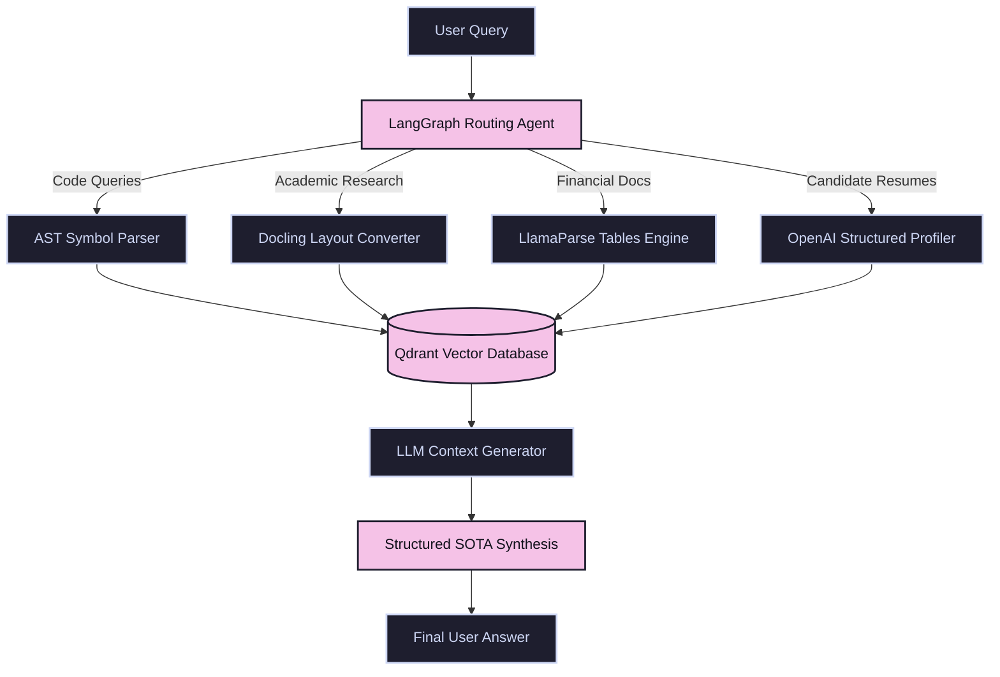

<div align="center">

# 🧠 SOTA Micro-RAG

**A State-of-the-Art, Multi-Corpus Retrieval-Augmented Generation Engine.**  
*Flattened architecture. Enterprise-grade reasoning. Built in 5 files.*

[](https://github.com/ashishpatill/Learning-RAG/stargazers)
[](https://www.python.org/)
[](https://opensource.org/licenses/MIT)
[](https://github.com/langchain-ai/langgraph)
[](https://qdrant.tech/)

<p align="center">
  <a href="#-the-problem">The Problem</a> •
  <a href="#-the-solution">The Solution</a> •
  <a href="#-architecture">Architecture</a> •
  <a href="#-quickstart">Quickstart</a> •
  <a href="#-detailed-pipeline">Pipelines</a> •
  <a href="#-roadmap">Roadmap</a>
</p>

</div>

---

> [!NOTE]
> **SOTA Micro-RAG** is designed for engineers who want enterprise-grade RAG performance without the over-engineered "folder hell" of typical modern frameworks. The entire system is implemented in **exactly 5 readable Python files** at the root level.

---

## ⚠️ The Problem: RAG Over-Engineering

Modern RAG projects are often drowned in hundreds of files, deep directories, custom wrapper classes, and undocumented configuration files. This makes them:
1. **Impossible to debug**: Stepping through code requires jumping across 10 directories.
2. **Difficult to customize**: Hardcoded abstractions prevent you from easily editing prompts, routing conditions, or chunking parameters.
3. **Fragile**: Highly-nested structures lead to circular import issues and package mismatches.

## 💡 The Solution: SOTA Micro-RAG

This repository flattens your architecture to just **5 core files**, combining **LangGraph** orchestration, **Qdrant** search, **AST code chunking**, **Docling** research indexing, and **LlamaParse** financial table extractions.

### 🔌 Out-of-the-Box Zero-Config Fallbacks
We built a resilient fallback system so the project **runs instantly without configuration**:
* **No Qdrant/Docker?** The system auto-detects and spins up a local disk database (`./qdrant_local/`) on the fly.
* **No OpenAI Key?** Auto-swaps in `FakeEmbeddings` and mock generation outputs so you can run the entire pipeline end-to-end in dry-run mode immediately.
* **No Docling/LlamaParse?** Gracefully falls back to pure-Python `pypdf` parsing.

---

## 🏗 Architecture

Unlike traditional RAG systems that rely on a single, naive text splitter, SOTA Micro-RAG routes user requests to **domain-specific ingestion pipelines** and coordinates them with a **LangGraph State Machine**:



---

## 📂 Flat File Structure

Every single line of logic lives in one of these 5 root-level files:

| File | Lines of Code | Core Responsibility |
| :--- | :---: | :--- |
| **[`config.py`](file:///Volumes/Developer/Learn/Agentic%20Ai/RAG/RAG%20Projects/Learning-RAG/config.py)** | ~16 | Settings, models configurations, and environment variable loaders. |
| **[`models.py`](file:///Volumes/Developer/Learn/Agentic%20Ai/RAG/RAG%20Projects/Learning-RAG/models.py)** | ~39 | Pydantic data schemas (including structured candidate profiles). |
| **[`store.py`](file:///Volumes/Developer/Learn/Agentic%20Ai/RAG/RAG%20Projects/Learning-RAG/store.py)** | ~47 | Qdrant client connection manager and auto-fallback storage initializer. |
| **[`ingest.py`](file:///Volumes/Developer/Learn/Agentic%20Ai/RAG/RAG%20Projects/Learning-RAG/ingest.py)** | ~280 | Domain-specific parsing pipelines (AST, Docling, LlamaParse, structured OCR). |
| **[`main.py`](file:///Volumes/Developer/Learn/Agentic%20Ai/RAG/RAG%20Projects/Learning-RAG/main.py)** | ~125 | LangGraph state graph compiler (Router Node -> Retriever Node -> Generator Node). |

---

## 🛠 Quickstart

### 1. Installation
Clone and create your virtual environment (fully compatible with Python 3.10+ and Apple Silicon macOS):

```bash
git clone https://github.com/ashishpatill/Learning-RAG.git
cd Learning-RAG

# Create virtual environment
python3 -m venv .venv
source .venv/bin/activate

# Install native packages
pip install -r requirements.txt
```

### 2. Add Test Files
Place your documents into their respective subdirectories inside `data/`:
* `data/code/` — Python, TS, JS, Kotlin files.
* `data/finance/` — Quarterly/annual results (PDFs).
* `data/research/` — Scientific or research papers (PDFs).
* `data/resumes/` — Candidate resumes (TXT, MD, PDF).

> [!TIP]
> To quickly populate mock files for immediate dry-run testing, run:
> ```bash
> python -c "import os; [os.makedirs(f'data/{d}', exist_ok=True) for d in ['code', 'finance', 'research', 'resumes']]"
> ```

### 3. Ingest Documents
Run the ingestion script to parse and index the data:
```bash
python ingest.py
```

### 4. Query the LangGraph Agent
Query the agent directly from the terminal. The system automatically routes the query to the correct corpus:
```bash
python main.py "find the subtract function in calculator"
```

---

## 🔍 Detailed Domain Pipelines

### 💻 Code Pipeline
* **Engine**: Custom AST-aware parsing for Python code.
* **Metadata**: Maps functions, classes, methods, and their parent classes.
* **Why**: Avoids dividing functions mid-line, ensuring the LLM always gets complete, compilable blocks of code with its hierarchical context.

### 👤 Resume Pipeline
* **Engine**: OpenAI structured extraction (`with_structured_output`) with Pydantic constraint.
* **Metadata**: Parses name, email, years of experience, companies, and skills into a schema-enforced profile.
* **Why**: Allows precise vector searches and metadata filtering (e.g. "Find candidates with >4 years of experience who know Python").

### 📈 Finance Pipeline
* **Engine**: `LlamaParse` table extraction.
* **Why**: Preserves nested markdown tables, row structures, and financial metrics in dense PDF tables.

### 📄 Research Pipeline
* **Engine**: `Docling` document layout analyzer.
* **Why**: Converts multi-column academic PDFs with complex header hierarchies and inline references into a clean, markdown outline.

---

## 🎯 Roadmap

- [ ] **Ollama/Local LLM Integration** — Run entirely locally using Mistral / Llama 3.
- [ ] **Hybrid Retrieval** — Integrate dense vector embeddings with sparse BM25 keyword search.
- [ ] **Context Compression** — Add LLMLingua or rerankers (like Cohere) to reduce input token usage.
- [ ] **Web Search Routing** — Dynamic LangGraph routing to Google/Bing when the local database lacks the answer.

---

## 🤝 Contributing

We welcome stars, forks, and contributions! Feel free to open an Issue or submit a Pull Request if you'd like to help implement the items on our Roadmap.

---

<div align="center">
  <i>If you find this project useful, give it a ⭐️ on GitHub to show your support!</i>
</div>
