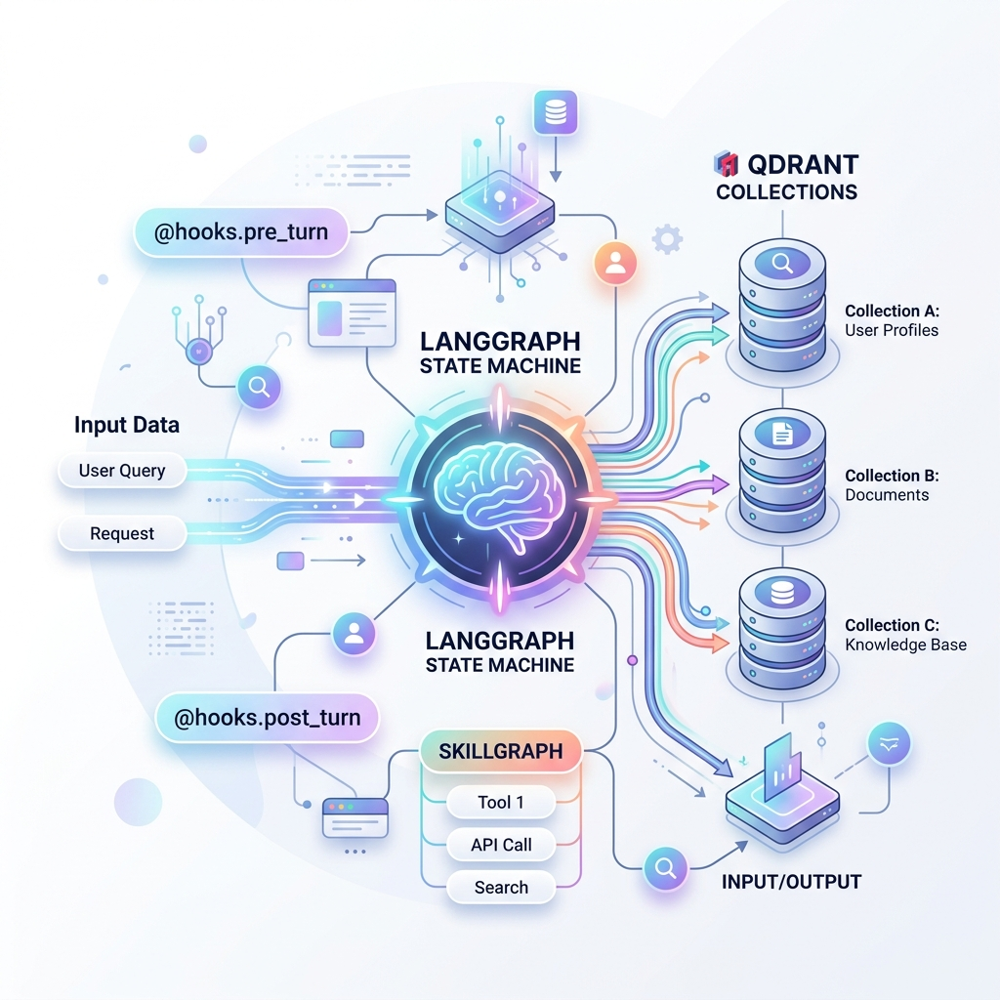

# BIMAgent: The Cognitive Orchestrator

## The Breakthrough
To build a system capable of answering profound, multi-hop research queries, we realized that static routing pipelines are insufficient. The ecosystem required a dynamic "brain" capable of breaking down complex problems and delegating them to specialized sub-agents. 

**BIMAgent** is the central cognitive orchestrator of the BIMRAG ecosystem. Built upon the Google Antigravity SDK, it dynamically constructs skillgraphs and routes queries based on semantic complexity.

## The Model-Agnostic Engine
Unlike traditional chatbot backends that simply pass text to a single LLM, BIMAgent is designed to orchestrate a fleet of models and tools. It intercepts user queries, evaluates what kind of data is required, and autonomously summons the `BIMIndex` Tri-Modal dispatcher or the `BIMExtract` ingestion engine.



This approach guarantees that:
1. **Any Model Can Be Used**: The orchestration logic is completely decoupled from the generation model. You can plug in local models, cloud APIs, or specialized fine-tunes without altering the application logic.
2. **Deep Research is Possible**: By utilizing lifecycle hooks (`@hooks.pre_turn`, `@hooks.post_turn`), the agent tracks multi-step goal execution loops, allowing it to "think" and research over extended periods before returning an answer.

### LangGraph State Machine
For deterministic local routing, BIMAgent also implements a strict LangGraph state machine workflow.

## Setup & Execution

### Running the API Server (FastAPI)
```bash
# Start the uvicorn server on port 8000
python -m uvicorn app.main:app --host 127.0.0.1 --port 8000 --reload
```

### Running the Antigravity Orchestrator
```bash
pip install google-antigravity
python orchestrator.py
```
